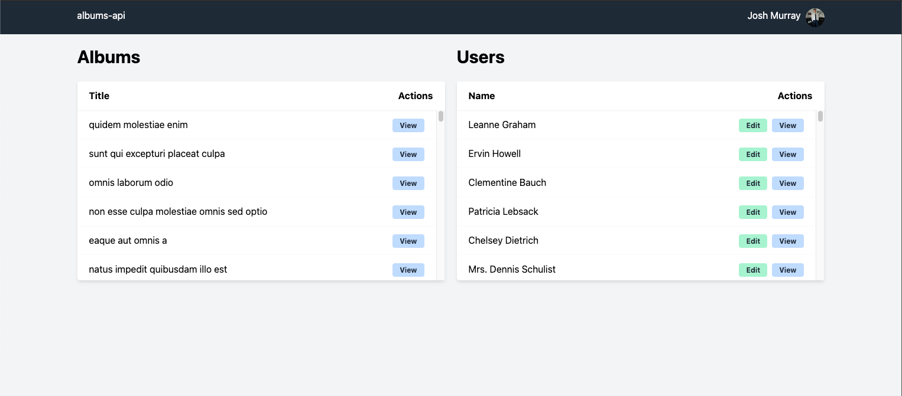

# albums

A simple POC of a UI and an API working through Docker.

## Getting Started

To run the application on your machine, firstly clone the entire repository using the following command:

```shell
git clone --recurse-submodules git://github.com/joshmurrayeu/albums.git
```

or if you're on an older version of `git`:

```shell
git clone --recursive git://github.com/joshmurrayeu/albums.git
```

Next, change directory to the repository directory. Run this command to build the docker images and run them in the background:

```shell
docker-compose up -d --build
```

Note: `--build` isn't actually necessary however it's a habit of mine always to add it to this command.

Once the container has been built (or when all 5 services are running), you'll need to migrate the database and run the seeders in order to populate the fake data. Run these
commands:

```shell
docker exec -it albums_albums-api_1 /bin/bash
cd ../albums-api
php artisan migrate --seed
```

If you get a `Error: No such container` error, run `docker ps` to find the name of the `albums_albums-api` container and use this name instead of the one
above (`albums_albums-api_1`).

If you're using Windows, you may need to put these values in your `hosts` file:

```text
127.0.0.1 api.albums.test
127.0.0.1 ui.albums.test
```

Finally, open a web browser and navigate to http://ui.albums.test/. Hopefully you should see:



## Structure

The structure of the application is a little different from other forms of POCs like this.

I have decided to have the API code in one repository (`albums-api`) and the UI in another (`albums-ui`). This repository (`albums`) brings them both together through [Git Submodules](https://git-scm.com/book/en/v2/Git-Tools-Submodules).

## Questions?

Let me know :) 